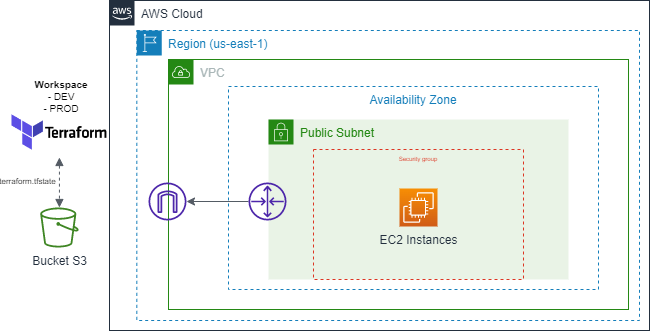
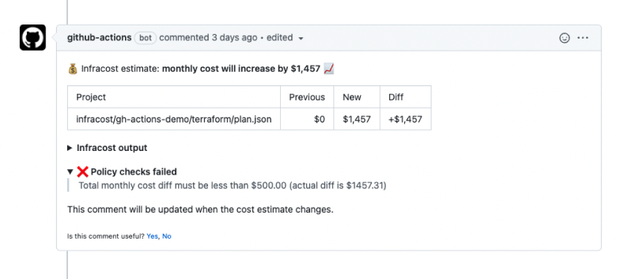

## Laboratório Terraform + Github Actions

> Este laboratório foi realizado para ministrar a disciplina de Cultura e Práticas DevOps (PucMinas).

Neste laboratório foi realizado o deploy da infraestrutura AWS com Terraform e CICD com Github Actions.

Criação da infraestrutura AWS com Terraform. 



Recursos criados:
- VPC
- Internet Gateway
- Subnet
- Security Group
- EC2
- Backend S3 - Armazenar o tfstate

---

Workflows Github Actions:

- Infracost - Controlar o custo da infraestrutura para todos os pull requests abertos para a branch principal. Verificando se está dentro da política de custo criada. (https://www.infracost.io/docs/features/cost_policies/)

- Deploy dos recursos AWS
- Destroy dos recursos AWS
- Pull Title Checker[https://github.com/thehanimo/pr-title-checker] - Verificar se o título do Pull Request está dentro dos padrões (https://www.conventionalcommits.org/).

---

Adicionar os segredos no Github:

- AWS_ACCESS_KEY_ID
- AWS_SECRET_ACCESS_KEY
- AWS_PUBLIC_KEY: Chave pública para acessar a instância EC2
```sh
$ ssh-keygen
```
- INFRACOST_API_KEY: Chave para calcular o custo da infraestrutura
```sh
# Efetuar o login
$ infracost auth login
# Recuperar a chave
$ infracost configure get api_key
```